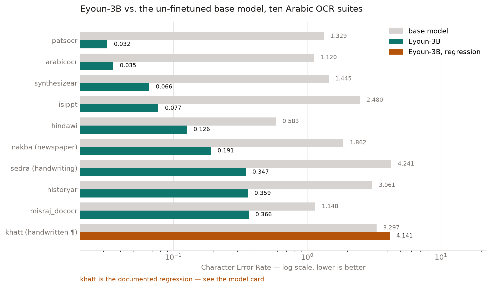

# Eyoun · عيون

**Arabic document OCR that runs offline, on a laptop.**

Eyoun-3B reads a scanned Arabic page — printed book, manuscript, newspaper column,
handwriting — and returns the text that is on it. It transcribes; it does not translate,
summarise or paraphrase. It is a 3B vision-language model that fits in 3.1 GB quantised
and runs locally under llama.cpp or LM Studio: no API key, no upload, no per-page cost,
and nothing leaves the machine.

It was trained as a QLoRA on **one 12 GB laptop GPU** (RTX 5070 Ti Laptop) over six SFT
stages and ~289k audited rows — and the model that shipped was not produced by any of
those stages. It was produced by [weight arithmetic](#the-part-worth-stealing) over two of
them, in seconds, with zero gradient steps.



Character Error Rate, lower is better, scored raw by `eval/run_eval.py` — every number
comes from the `summary.json` files committed in [`results/`](results/). Nine suites
improve by 5–40×. One gets worse, and it is named on the chart rather than dropped from it.

## Run it

```bash
# 1 — build llama.cpp with multimodal support
git clone https://github.com/ggml-org/llama.cpp && cmake -B llama.cpp/build llama.cpp && cmake --build llama.cpp/build -j

# 2 — put the model and its vision projector in ./models
#     Eyoun-3B-Q8_0.gguf  +  mmproj-Eyoun-3B-f16.gguf   (both required)

# 3 — read a page
llama.cpp/build/bin/llama-mtmd-cli -m models/Eyoun-3B-Q8_0.gguf \
    --mmproj models/mmproj-Eyoun-3B-f16.gguf --temp 0 --repeat-penalty 1.2 \
    --image page.png -p "استخرج النص من الصورة."
```

In LM Studio, drop the folder into your models directory instead — it picks up the
`mmproj-*.gguf` automatically.

The repetition controls are not optional. Without `--temp 0` and a repetition penalty the
model can loop on dense pages.

> **Weights are not published yet.** This repository is the *method, tooling and
> evaluation* — it contains no datasets and no weights. The GGUF build it describes
> (Q4_K_M 1.8 GB · Q8_0 3.1 GB · f16 5.8 GB, plus the 1.3 GB vision projector) is
> specified in [`docs/MODEL_CARD.md`](docs/MODEL_CARD.md) and is released separately.

### If you want HTML tables, run the post-processor

The model emits **markdown** pipe tables. Convert them if your target format is HTML:

```python
from tools.postprocess import md_tables_to_html
text = md_tables_to_html(model_output)
```

This is not cosmetic. On the misraj benchmark it is the difference between **TEDS 2.9 and
18.3** — the same output, scored two ways. The inverse (`html_tables_to_md`) is provided
too, so the output format is your choice at inference time rather than a training target.

## What it does not do

Read this section before you adopt it.

* **Handwritten paragraphs are worse than the base model.** CER 4.14 against the base
  model's 3.30 on `arocrbench_khattparagraph` — it hallucinates on dense multi-line
  handwriting. Five training stages aimed at this failed. Use something else for that
  input. Single-line handwriting (`sedra`, CER 0.347) is fine.
* **It is not state of the art.** Baseer, the reference Arabic doc-OCR model, scores
  WER 0.25 / TEDS 66 against Eyoun's 0.533 / 18.3. Baseer is 7B, trained with far more
  data and compute. Treat Eyoun as a strong *local and offline* option, not a SOTA claim.
* **Table structure is mediocre.** Text inside tables is usually recoverable; the grid
  often is not.
* **Markdown emphasis is inconsistent**, and `#` headings are over-produced. Don't rely on
  the markup being faithful.
* **Digits are the weakest character class.** Long numeric sequences are error-prone at
  every precision, and Arabic-Indic numerals sometimes come back as Western ones. Verify
  numbers that matter.
* **No datasets, no weights, no checkpoints in this repository.** The corpora are
  third-party, each under its own licence.

## The part worth stealing

**The best model was produced by weight arithmetic, not by training.**

Five of six training stages were rejected on evaluation. The shipped champion is an exact
linear combination of two of them:

```
champion = 0.5 · (0.5 · stage4 + 0.5 · stage5) + 0.5 · stage6.1
```

built with [`tools/task_vector.py`](tools/task_vector.py) in seconds, with zero gradient
steps — and it beat the previous champion 6 wins / 4 flat / **zero regressions** across the
full ten-suite evaluation.

The exactness matters. Blending LoRA adapters elementwise is *wrong*: `(B₁+B₂)@(A₁+A₂)`
introduces cross terms `B₁@A₂ + B₂@A₁` that belong to neither adapter. Concatenating on the
rank axis instead realises the sum of products exactly:

```
A' = [A₁ ; A₂ ; …]              (Σr, in)
B' = [c₁·B₁ , c₂·B₂ , …]        (out, Σr)      ⟹   B'@A' = Σ cᵢ·Bᵢ@Aᵢ
```

with `lora_alpha` scaled by the same factor so peft's `alpha/r` stays invariant. Verified
to ~1e-10. Valid for any coefficients, including negative ones — which is what makes
λ-sweeping a rejected adapter's task vector possible. That is how a fully rejected stage
ended up as half the champion.

The rest of what this cycle cost — including the two DPO runs that failed, one of them
catastrophically — is in [`docs/ENGINEERING_LOG.md`](docs/ENGINEERING_LOG.md).

## Layout

| path | what |
|---|---|
| `tools/task_vector.py` | exact LoRA task-vector arithmetic (the technique above) |
| `tools/teds.py` | TEDS table-structure metric — PubTabNet definition, Zhang-Shasha tree edit distance, pure stdlib, no dependencies |
| `tools/postprocess.py` | markdown ⇄ HTML table conversion; part of the champion's inference config |
| `tools/build_unified_dataset.py` | corpus assembly and audit — the data recipe, without the data |
| `eval/run_eval.py` | ten-suite harness (`--suite`, `--limit`, `--md_tables_to_html`) |
| `eval/dev_eval.py` | ~160-sample dev slice with a collapse canary; aborts a bad candidate in ~6 min |
| `train/stage*.py` | the six SFT stages |
| `train/dpo.py` | the DPO attempt — kept because it failed instructively |
| `train/merge_champion.py` | streaming LoRA merge that works in 12 GB |
| `configs/` | the exact run configuration for every stage |
| `results/` | one `summary.json` per adapter; the source of every number above |
| `docs/MODEL_CARD.md` | the released model, its numbers and its limits |
| `docs/ENGINEERING_LOG.md` | what was tried, what failed, what it cost |

## Reproduce the training

```bash
export EYOUN_HOME=/path/to/workdir       # adapters, checkpoints, data
export EYOUN_DATASETS=/path/to/datasets  # HuggingFace corpora, see build_unified_dataset.py
pip install -r requirements.txt
python tools/build_unified_dataset.py && python train/stage1.py
python tools/task_vector.py --out $EYOUN_HOME/train/adapters/soup --mix eyoun-s4:0.5 --mix eyoun-s5:0.5
```

Three evaluation lessons that cost real time to learn:

* **Score raw and post-processed separately.** The champion is TEDS 2.9 raw and 18.3
  converted; another candidate is the reverse. Judging on one mode alone rejects the
  right model.
* **Small dev slices cannot rank the hard suite.** Each adapter has its own novel failure
  set, so any fixed index set misses it. The dev slice is a collapse *detector*, not a
  ranker.
* **Training metrics do not predict evaluation collapse** at this data scale. One run had
  healthy loss, margins and accuracy while destroying the model. Evaluate mid-run.

## Licence

MIT — see [LICENSE](LICENSE). The model itself additionally follows the licence of its base
model (Qwen2.5-VL-3B-Instruct) and of the training corpora.

---

<div dir="rtl">

# عيون — التعرّف الضوئي على المستندات العربية

**نموذج يقرأ الصفحة العربية الممسوحة ضوئيًا ويعيد نصّها، ويعمل محليًا على حاسوب محمول.**

يقرأ Eyoun-3B الصفحة العربية — كتابًا مطبوعًا أو مخطوطة أو عمودًا صحفيًا أو خطًّا يدويًا —
ويعيد النص الموجود فيها كما هو. ينسخ النص ولا يترجمه ولا يلخّصه ولا يعيد صياغته. حجمه
٣ مليارات معامل، ويتقلّص إلى ٣٫١ غيغابايت بعد التكميم، ويعمل عبر llama.cpp أو LM Studio
دون مفتاح واجهة برمجية ودون رفع أي صفحة إلى الإنترنت — لا تغادر بياناتك جهازك.

دُرِّب بأسلوب QLoRA على بطاقة رسوميات واحدة سعتها ١٢ غيغابايت، عبر ستّ مراحل تدريب
وقرابة ٢٨٩ ألف صف مُدقَّق. والنموذج الذي صدر لم تنتجه أيٌّ من تلك المراحل، بل أنتجته
**عملية حسابية على الأوزان** جمعت اثنتين منها في ثوانٍ ودون أي خطوة تدريب إضافية.

## التشغيل

نفّذ الأوامر الثلاثة في قسم [Run it](#run-it) أعلاه: ابنِ llama.cpp، ثم ضع ملفَّي النموذج
في مجلد `models`، ثم شغّل `llama-mtmd-cli` على صورة الصفحة. الملفّان **كلاهما مطلوب**:
ملف النموذج وملف المُسقِط البصري `mmproj`؛ وبدون الثاني يتحوّل النموذج إلى نصّي فقط.

استخدم `--temp 0` مع عقوبة التكرار — فبدونها قد يدخل النموذج في حلقة تكرار على الصفحات
الكثيفة. وإذا كنت تريد جداول HTML بدل جداول markdown، مرِّر المخرجات على
`tools/postprocess.py`؛ فالفارق في مقياس TEDS بين الحالتين هو ٢٫٩ مقابل ١٨٫٣.

**الأوزان لم تُنشر بعد.** هذا المستودع يضمّ المنهج والأدوات ومنظومة التقييم فقط، ولا يضمّ
بيانات ولا أوزانًا. ومواصفات ملفات GGUF مذكورة في [`docs/MODEL_CARD.md`](docs/MODEL_CARD.md).

## حدود النموذج

* **الفقرات المكتوبة بخط اليد أسوأ من النموذج الأساسي** (معدّل خطأ الأحرف ٤٫١٤ مقابل ٣٫٣٠).
  استخدم أداة أخرى لهذا النوع من المدخلات. أما الخط اليدوي أحادي السطر فأداؤه جيد (٠٫٣٤٧).
* **ليس الأفضل عالميًا.** نموذج «بصير» المرجعي يتفوّق عليه (معدّل خطأ الكلمات ٠٫٢٥ مقابل
  ٠٫٥٣٣)، لكنه نموذج بسبعة مليارات معامل دُرِّب بموارد أكبر بكثير. قيمة «عيون» أنه محلي
  ويعمل دون اتصال.
* **بنية الجداول متوسطة الجودة.** النص داخل الجدول يمكن استرجاعه غالبًا، أما الشبكة فلا.
* **الأرقام هي أضعف فئة.** تحقّق يدويًا من التسلسلات الرقمية الطويلة، وقد يحوّل النموذج
  الأرقام العربية-الهندية إلى غربية.
* **لا بيانات ولا أوزان في هذا المستودع.** المجموعات التدريبية ملك أصحابها، كلٌّ برخصته.

## الرخصة

رخصة MIT للشيفرة في هذا المستودع. أما النموذج نفسه فيتبع رخصة النموذج الأساسي
(Qwen2.5-VL-3B-Instruct) ورخص المجموعات التدريبية.

</div>
